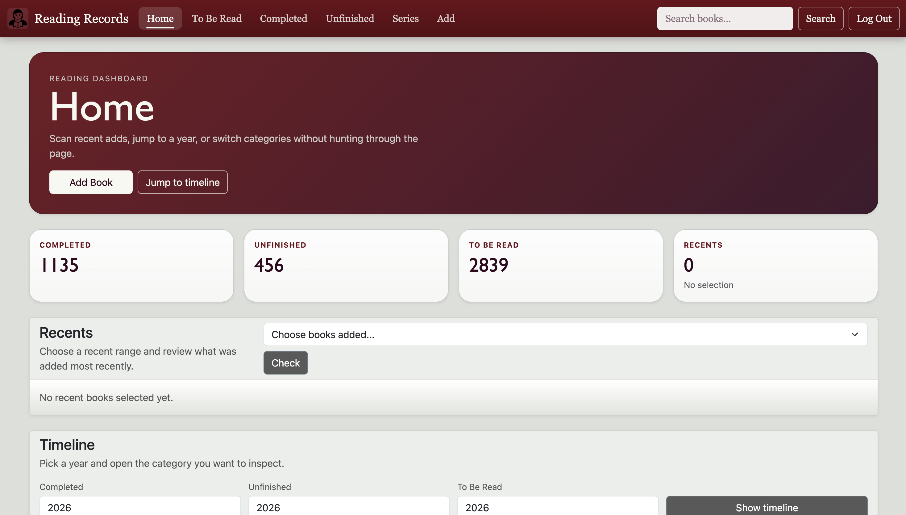
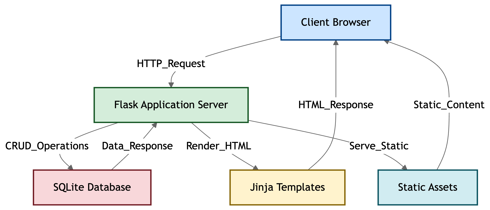

# Reading Records 


## Description
- Book list for unpublished books 
   - e.g. Wattpad, 晋江文学城

## Technologies Used:
1. Flask
2. Flask-Session
3. cs50 SQL library
4. Jinja
5. HTML, CSS, JavaScript
6. Bootstrap 5
7. SQLite3



## Features:
1. Login functionality allows user's book list and tastes to remain privacy 
2. Status with standard options like Finishing, Finishing Soon, Left Extras, Uncompleted & customisable option to type anything user prefers
3. Three categories of "Completed", "Unfinished"(i.e. DNF) & "To Be Read" with their respective pages
4. Randomly choose a book in one of those categories
5. Automatically calculates days taken to read the book (days between addition of previous book to current addition)
6. Filters to check for existence of genres, notes, or series
7. Timeline views of books added
   - Specific year: books added to 1 of the above categories in specified year
   - Recents: books added today, this week or this month
8. Search function that returns books (even if complete name is not entered)
9. Convenient switching function from "Unfinished" & "To Be Read" to "Completed" and each other
10. Easily add 1 to number of times reread
11. Import multiple books from a .txt file to "Completed", "Unfinished" or "To Be Read"
## Possible Improvements:
- [ ] Filter by language
- [ ] Input to set number of rereads
- [ ] Link to book website (e.g. Wattpad, 晋江文学城）
  - Automatically retrieve status of book
- [ ] Prompt for reviews when switched to "Completed"
- [ ] Estimated time of completion for book (data analytics)
- [ ] Show periods of times where some genres are preferred (clustering)
- [x] Tags that can be used as reusable notes (e.g. #nice) or standard genres (e.g. #fiction)
- [x] Symbol to represent anticipated book (e.g. ✔️)
- [x] Number to represent series (for unnamed book series)
- [x] Edit book name & other fields by clicking on them in the list view (respective pages)

# How to visit?
## localhost
1. Clone repository/Download zip file 
2. Open folder in VS Code
3. Install the dependencies inside the project virtual environment

```bash
source .venv/bin/activate
pip install -r requirements.txt
```
4. Run the app in VS Code's terminal

```bash
flask --app app run --debug
```
## Online
1. Go to https://phoebe05.pythonanywhere.com/

**_Disclaimer: Cannot choose password if on Safari_**
# How to use?
- Watch CS50.mp4


